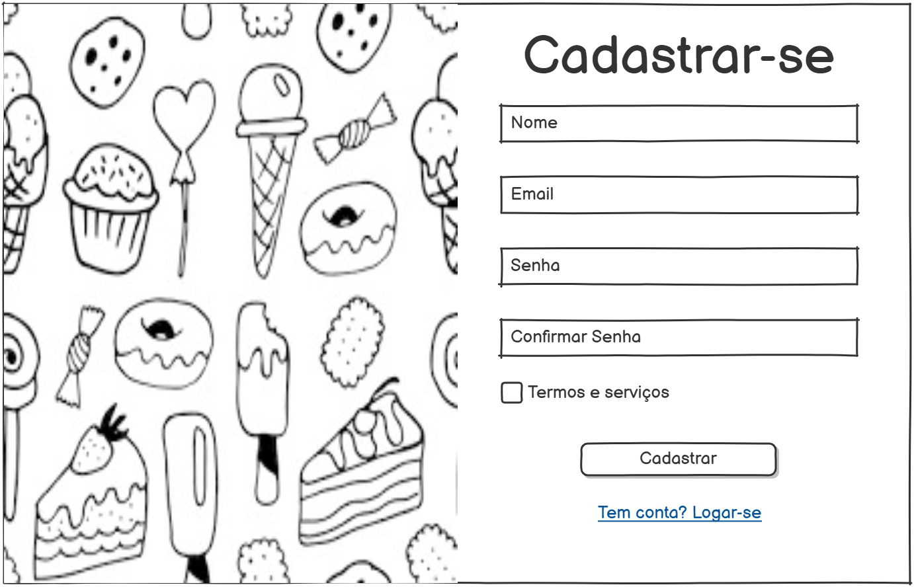

# Sweetiefy

## 💡 Problema 
Muitas vezes confeiteiros possuem problemas na hora de estipular preços para as vendas de seus produtos, seja por conta da inflação dos valores de ingredientes ou por estarem trabalhando com uma margem de lucro muito baixa, podendo consequentemente levar a prejuízos.

Diante disto, o Sweetiefy tem como objetivo auxiliar os vendedores na gestão e precificação de receitas de doces. 

O sistema deve permitir o usuário cadastrar e definir o preço de cada receita, sendo possível também estimar o lucro por cada venda. Seria interessante a implementação de um histórico de vendas, para estimar as vendas realizadas no mês.

O valor de custo por receita também deve ser visualizado e alterado, sendo atualizado ao selecionar os ingredientes para uma determinada receita.

A opção de uma margem de lucro manipulável também é uma possibilidade, ela poderia ajustar ou sugerir um preço ideal para a venda de um determinado doce, visando a margem de lucro escolhida pelo usuário.

## 👥 Atores / Decisores
* Atores: Usuários gerais, confeiteiros.
* Decisores/Apoiadores: Professores; Coordenação do Curso.

## 🛠 Casos de uso
* Usuários: Logar/deslogar, CRUD usuários.
* Receitas: CRUD receitas.
* Ingredientes: CRUD ingredientes.
* Pedidos: CRUD, definir taxa, manipular histórico de vendas.
* Clientes: CRUD clientes.

## ⌛ Limites e suposições
### Limites
- Entrega até o final da disciplina (2025-11-30);
- Rodar no navegador;
- Sem serviços pagos.

### Suposições
- Internet no laboratório;
- Testes rápidos (10 min no máximo);
- Navegador atualizado;
- Acesso ao repositório no Github.

### Plano B
- Sem internet: Rodar localmente e salvar dados em LocalStorage ou arquivo;
- Sem tempo do professor: Realizar testes com outros 3 usuários.

## ✔️ Hipóteses e validação
Valor: Se o usuário visualiza os ingredientes cadastrados, consegue organizar melhor suas receitas.

Validação: Teste com 4 usuários distintos em máquinas diferentes. Sucesso caso 3≥ conseguem visualizar os registros corretamente.

Viabilidade: Medição no protótipo com 20 ações diferentes, atendendo no mínimo 17/20 (9/10) ações com no máximo 1s de resposta.

## 📈 Fluxo principal e primeira fatia
**Fluxo principal (curto):**
1) Usuário entra no site;
2) Usuário faz login ou cadastro;
3) Usuário clica em adicionar ingredientes;
4) Usuário salva os ingredientes;
5) Ingredientes são exibidos ao usuário.

## 💻 Esboços de algumas telas (wireframes)



## ⚙️ Tecnologias

### 8.1 Navegador
**Navegador:** [HTML/CSS/JS/Bootstrap]

**Armazenamento local (se usar):** [LocalStorage]

**Hospedagem:** [GitHub Pages]

### 8.2 Front-end (servidor de aplicação, se existir)
**Front-end (servidor):** [React]

**Hospedagem:** [GitHub Pages]

### 8.3 Back-end (API/servidor, se existir)
**Back-end (API):** [Javascript + Express]

**Banco de dados:** [Postgres/MySQL]

**Deploy do back-end:** [Render] "Verificando possibilidades de uso"

## 📋 Plano de Dados (Dia 0) — somente itens 1–3

### 9.1 Entidades
- Usuarios — Representa os indivíduos que utilizaram o sistema
- Ingredientes — Representa os ingredientes utilizados em receitas
- Receitas — Representa as receitas criadas no sistema
- Clientes — Representa os indivíduos que realizaram os pedidos
- Pedidos — Representa os pedidos realizados das receitas

### 9.2 Campos por entidade

### Usuarios
| Campo | Tipo | Obrigatório | Exemplo |
|-----------------|-------------------------------|-------------|--------------------|
| id | número | sim | 1 |
| nome | texto | sim | "Ana Souza" |
| email | texto | sim (único) | "ana@exemplo.com" |
| senha_hash | texto | sim | "$2a$10$..." |
| papel | número (0=comum, 1=administrador) | sim | 0 |
| dataCriacao | data/hora | sim | 2025-08-20 14:30 |
| dataAtualizacao | data/hora | sim | 2025-08-20 15:10 |

### Ingredientes
| Campo | Tipo | Obrigatório | Exemplo |
|-----------------|--------------------|-------------|-------------------------|
| id | número | sim | 2 |
| nome | texto | sim | "Chocolate Granulado" |
| preco | número | sim | 4,99 |
| metrica | enum | sim | 1 |
| usuario_id | número (fk) | sim | 1 |
| dataCriacao | data/hora | sim | 2025-08-20 14:30 |
| dataAtualizacao | data/hora | sim | 2025-08-20 15:10 |

### Receitas
| Campo | Tipo | Obrigatório | Exemplo |
|-----------------|--------------------|-------------|-------------------------|
| id | número | sim | 3 |
| nome | texto | sim | "Casadinho" |
| descricao | texto | não | "2 caixas de leite condensado..." |
| usuario_id | número (fk) | sim | 1 |
| imagem_url | texto | não | /imagem/doce.png |
| preco | número | sim | 4,99 |
| dataCriacao | data/hora | sim | 2025-08-20 14:30 |
| dataAtualizacao | data/hora | sim | 2025-08-20 15:10 |

### Receitas_Ingredientes
| Campo | Tipo | Obrigatório | Exemplo |
|-----------------|--------------------|-------------|-------------------------|
| id | número | sim | 3 |
| receita_id | número (fk) | sim | 1 |
| ingrediente_id | número (fk) | sim | 1 |
| quantidade | número | sim | 3 |

### Clientes
| Campo | Tipo | Obrigatório | Exemplo |
|-----------------|--------------------|-------------|-------------------------|
| id | número | sim | 4 |
| nome | texto | sim | "Ana" |
| email | texto | sim | "ana@gmail.com" |
| telefone | texto | sim | (49) 9192-7122 |
| endereço | texto | não | Av. Papa João XXIII |
| usuario_id | número (fk) | sim | 1 |
| dataCriacao | data/hora | sim | 2025-08-20 14:30 |
| dataAtualizacao | data/hora | sim | 2025-08-20 15:10 |

### Pedidos
| Campo | Tipo | Obrigatório | Exemplo |
|-----------------|--------------------|-------------|-------------------------|
| id | número | sim | 5 |
| cliente_id | número (fk) | sim | 2 |
| usuario_id | número (fk) | sim | 1 |
| preco_total | número | sim | 4,99 |
| prioridade | enum | sim | 'Alta' |
| margem_lucro | número | sim | (10%) 0.1 |
| estado | enum | sim | 'Aberto' |
| dataCriacao | data/hora | sim | 2025-08-20 13:10 |
| dataAtualizacao | data/hora | sim | 2025-08-24 17:10
| dataLimite | data/hora | sim | 2025-08-25 18:15

### Pedidos_Receitas
| Campo | Tipo | Obrigatório | Exemplo |
|-----------------|--------------------|-------------|-------------------------|
| id | número | sim | 3 |
| pedido_id | número (fk) | sim | 2 |
| receita_id | número (fk) | sim | 2 |
| quantidade | número | sim | 45 |
| preco_unitario | número | sim | 4,99 |


### 9.3 Relações entre entidades
- Receitas ↔ Ingredientes (N↔N) → tabela Receitas_Ingredientes
- Clientes → Pedidos (1→N)
- Pedidos ↔ Receitas (N↔N) → tabela Pedidos_Receitas
- Usuarios → Receitas (1→N)
- Usuarios → Ingredientes (1→N)
- Usuarios → Clientes (1→N)
- Usuarios → Pedidos (1→N)

### 9.4 Modelagem Postgres
```sql
--Enum para prioridades
CREATE TYPE prioridade_enum AS ENUM ('Baixa', 'Media', 'Alta');

--Enum para estados
CREATE TYPE estado_enum AS ENUM ('Aberto', 'Pendente', 'Cancelado', 'Finalizado');

--Enum para métricas
CREATE TYPE metrica_enum AS ENUM ('Kg', 'g', 'L', 'ml', 'unidade', 'mg');

--Comandos DDL:

--Criação da tabela usuários
CREATE TABLE usuarios (
    id SERIAL PRIMARY KEY,
    nome VARCHAR(100) NOT NULL,
    email VARCHAR(150) NOT NULL UNIQUE,
    senha_hash VARCHAR(255) NOT NULL,
    perfil SMALLINT NOT NULL CHECK (perfil IN (0,1)), -- Usuario,Admin
    data_criacao TIMESTAMP NOT NULL,
    data_atualizacao TIMESTAMP NOT NULL
);

--Criação da tabela ingredientes
CREATE TABLE ingredientes (
    id SERIAL PRIMARY KEY,
    nome VARCHAR(100) NOT NULL,
    preco DECIMAL(10,2) NOT NULL,
    metrica metrica_enum NOT NULL,
    usuario_id INT NOT NULL REFERENCES usuarios(id),
    data_criacao TIMESTAMP NOT NULL,
    data_atualizacao TIMESTAMP NOT NULL
);

--Criação da tabela receitas
CREATE TABLE receitas (
    id SERIAL PRIMARY KEY,
    nome VARCHAR(100) NOT NULL,
    descricao VARCHAR(255),
    usuario_id INT NOT NULL REFERENCES usuarios(id),
    imagem_url VARCHAR(255),
    preco NUMERIC(10,2) NOT NULL,
    data_criacao TIMESTAMP NOT NULL,
    data_atualizacao TIMESTAMP NOT NULL
);

--Criação da tabela auxiliar receitas_ingredientes
CREATE TABLE receitas_ingredientes (
    id SERIAL PRIMARY KEY,
    receita_id INT NOT NULL REFERENCES receitas(id),
    ingrediente_id INT NOT NULL REFERENCES ingredientes(id),
    quantidade DECIMAL(10,2) NOT NULL
);

--Criação da tabela clientes
CREATE TABLE clientes (
    id SERIAL PRIMARY KEY,
    nome VARCHAR(100) NOT NULL,
    email VARCHAR(150) NOT NULL UNIQUE,
    telefone VARCHAR(20) NOT NULL,
    endereco VARCHAR(255),
    usuario_id INT NOT NULL REFERENCES usuarios(id),
    data_criacao TIMESTAMP NOT NULL,
    data_atualizacao TIMESTAMP NOT NULL
);

--Criação da tabela pedidos
CREATE TABLE pedidos (
    id SERIAL PRIMARY KEY,
    cliente_id INT NOT NULL REFERENCES clientes(id),
    usuario_id INT NOT NULL REFERENCES usuarios(id),
    preco_total DECIMAL(10,2) NOT NULL,
    prioridade prioridade_enum NOT NULL,
    margem_lucro DECIMAL(5,2) NOT NULL,
    estado estado_enum NOT NULL,
    data_criacao TIMESTAMP NOT NULL,
    data_atualizacao TIMESTAMP NOT NULL,
    data_limite TIMESTAMP NOT NULL
);

--Criação da tabela pedidos_receitas
CREATE TABLE pedidos_receitas (
    id SERIAL PRIMARY KEY,
    pedido_id INT NOT NULL REFERENCES pedidos(id),
    receita_id INT NOT NULL REFERENCES receitas(id),
    quantidade DECIMAL(10,2) NOT NULL,
    preco_unitario DECIMAL(10,2) NOT NULL
);

--Comandos DML:

--Inserção usuários
INSERT INTO usuarios (nome, email, senha_hash, perfil, data_criacao, data_atualizacao)
VALUES
('Ana Souza', 'ana@exemplo.com', '$2a$10$abcdef...', 0, NOW(), NOW()),
('João Silva', 'joao@exemplo.com', '$2a$10$ghijkl...', 1, NOW(), NOW());

--Inserção ingredientes
INSERT INTO ingredientes (nome, preco, metrica, usuario_id, data_criacao, data_atualizacao)
VALUES
('Chocolate Granulado', 4.99, 'Kg', 1, NOW(), NOW()),
('Leite Condensado', 7.50, 'L', 2, NOW(), NOW());

--Inserção receitas
INSERT INTO receitas (nome, descricao, usuario_id, imagem_url, preco, data_criacao, data_atualizacao)
VALUES
('Casadinho', '2 caixas de leite condensado e 200g de chocolate', 1, '/imagens/casadinho.png', 4.99, NOW(), NOW()),
('Brigadeiro', 'Leite condensado, chocolate em pó e manteiga', 2, '/imagens/brigadeiro.png', 3.50, NOW(), NOW());

--Inserção receitas_ingredientes
INSERT INTO receitas_ingredientes (receita_id, ingrediente_id, quantidade)
VALUES
(1, 1, 200),
(2, 2, 1.5);

--Inserção clientes
INSERT INTO clientes (nome, email, telefone, endereco, usuario_id, data_criacao, data_atualizacao)
VALUES
('Carlos Mendes', 'carlos@gmail.com', '(49) 9192-7122', 'Av. Papa João XXIII', 1, NOW(), NOW()),
('Mariana Lima', 'mariana@gmail.com', '(49) 9181-3344', 'Rua Blumenau, 123', 2, NOW(), NOW());

--Inserção pedidos
INSERT INTO pedidos (cliente_id, usuario_id, preco_total, prioridade, margem_lucro, estado, data_criacao, data_atualizacao, data_limite)
VALUES
(1, 1, 4.99, 'Alta', 0.1, 'Aberto', NOW(), NOW(),NOW()),
(2, 2, 7.50, 'Media', 0.15, 'Aberto', NOW(), NOW(),NOW());

--Inserção pedidos_receitas
INSERT INTO pedidos_receitas (pedido_id, receita_id, quantidade, preco_unitario)
VALUES
(1, 1, 10, 4.99),
(2, 2, 20, 3.50);

--Comandos DQL:

--Listando receita e usuário que cadastrou
SELECT r.id, r.nome AS receita, r.descricao, r.preco, u.nome AS usuario
FROM receitas r
JOIN usuarios u ON r.usuario_id = u.id;

--Total gasto por cliente
SELECT c.nome AS cliente, SUM(p.preco_total) AS total_gasto
FROM pedidos p
JOIN clientes c ON p.cliente_id = c.id
GROUP BY c.nome;

--Listar por prioridade
SELECT p.id, c.nome AS cliente, u.nome AS usuario, p.preco_total, p.prioridade, p.estado
FROM pedidos p
JOIN clientes c ON p.cliente_id = c.id
JOIN usuarios u ON p.usuario_id = u.id
WHERE p.prioridade = 'Alta' AND p.estado = 'Aberto';

--Listar por ingrediente específico
SELECT r.nome AS receita, r.descricao
FROM receitas r
JOIN receitas_ingredientes ri ON r.id = ri.receita_id
JOIN ingredientes i ON ri.ingrediente_id = i.id
WHERE i.nome = 'Leite Condensado';

--Usuários que cadastraram mais de uma receita
SELECT u.nome, COUNT(r.id) AS total_receitas
FROM usuarios u
JOIN receitas r ON u.id = r.usuario_id
GROUP BY u.nome
HAVING COUNT(r.id) > 1;
```
