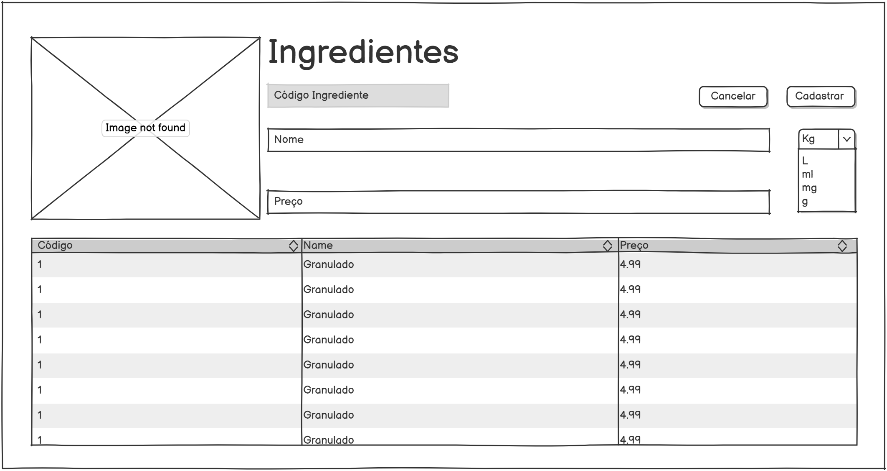

# Sweetiefy

## 💡 Problema 
Muitas vezes confeiteiros possuem problemas na hora de estipular preços para as vendas de seus produtos, seja por conta da inflação dos valores de ingredientes ou por estarem trabalhando com uma margem de lucro muito baixa, podendo consequentemente levar a prejuízos.

Diante disto, o Sweetiefy tem como objetivo auxiliar os vendedores na gestão e precificação de receitas de doces. 

O sistema deve permitir o usuário cadastrar e definir o preço de cada receita, sendo possível também estimar o lucro por cada venda. 

O valor de custo por receita também deve ser visualizado e alterado, sendo atualizado ao selecionar os ingredientes para uma determinada receita.

A opção de uma margem de lucro manipulável também é uma possibilidade, ela poderia ajustar ou sugerir um preço ideal para a venda de um determinado doce, visando a margem de lucro escolhida pelo usuário.

## 👥 Atores / Decisores
* Atores: Usuários gerais, confeiteiros.
* Decisores/Apoiadores: Professores; Coordenação do Curso.

## 🛠 Casos de uso
* Usuários: Logar/deslogar, CRUD usuários.
* Receitas: CRUD receitas.
* Ingredientes: CRUD ingredientes.

## ⌛ Limites e suposições
### Limites
- Entrega até o final da disciplina (2025-11-30);
- Rodar no navegador;
- Sem serviços pagos.

### Suposições
- Internet no laboratório;
- Testes rápidos (10 min no máximo);
- Navegador atualizado;
- Acesso ao repositório no Github.

### Plano B
- Sem internet: Rodar localmente e salvar dados em LocalStorage ou arquivo;
- Sem tempo do professor: Realizar testes com outros 3 usuários.

## ✔️ Hipóteses e validação
Valor: Se o usuário visualiza os ingredientes cadastrados, consegue organizar melhor suas receitas.

Validação: Teste com 4 usuários distintos em máquinas diferentes. Sucesso caso 3≥ conseguem visualizar os registros corretamente.

Viabilidade: Medição no protótipo com 20 ações diferentes, atendendo no mínimo 17/20 (9/10) ações com no máximo 1s de resposta.

## 📈 Fluxo principal e primeira fatia
**Fluxo principal (curto):**
1) Usuário entra no site;
2) Usuário faz login ou cadastro;
3) Usuário clica em adicionar ingredientes;
4) Usuário salva os ingredientes;
5) Ingredientes são exibidos ao usuário.

## 💻 Esboços de algumas telas (wireframes)




## ⚙️ Tecnologias

### 8.1 Navegador
**Navegador:** [HTML/CSS/JS/Bootstrap]

**Armazenamento local (se usar):** [LocalStorage]

**Hospedagem:** [GitHub Pages]

### 8.2 Front-end (servidor de aplicação, se existir)
**Front-end (servidor):** [React]

**Hospedagem:** [GitHub Pages]

### 8.3 Back-end (API/servidor, se existir)
**Back-end (API):** [Javascript + Express]

**Banco de dados:** [Postgres/MySQL]

**Deploy do back-end:** [Render] "Verificando possibilidades de uso"

## 📋 Plano de Dados (Dia 0) — somente itens 1–3

### 9.1 Entidades
- Usuarios — Representa os indivíduos que utilizaram o sistema
- Ingredientes — Representa os ingredientes utilizados em receitas
- Receitas — Representa as receitas criadas no sistema

### 9.2 Campos por entidade

### Usuarios
| Campo | Tipo | Obrigatório | Exemplo |
|-----------------|-------------------------------|-------------|--------------------|
| id | número | sim | 1 |
| nome | texto | sim | "Ana Souza" |
| email | texto | sim (único) | "ana@exemplo.com" |
| senha_hash | texto | sim | "$2a$10$..." |
| papel | número (0=comum, 1=administrador) | sim | 0 |
| dataCriacao | data/hora | sim | 2025-08-20 14:30 |
| dataAtualizacao | data/hora | sim | 2025-08-20 15:10 |

### Ingredientes
| Campo | Tipo | Obrigatório | Exemplo |
|-----------------|--------------------|-------------|-------------------------|
| id | número | sim | 2 |
| nome | texto | sim | "Chocolate Granulado" |
| preco | número | sim | 4,99 |
| metrica | enum | sim | 1 |
| usuario_id | número (fk) | sim | 1 |
| dataCriacao | data/hora | sim | 2025-08-20 14:30 |
| dataAtualizacao | data/hora | sim | 2025-08-20 15:10 |

### Receitas
| Campo | Tipo | Obrigatório | Exemplo |
|-----------------|--------------------|-------------|-------------------------|
| id | número | sim | 3 |
| nome | texto | sim | "Casadinho" |
| descricao | texto | não | "2 caixas de leite condensado..." |
| usuario_id | número (fk) | sim | 1 |
| imagem_url | texto | não | /imagem/doce.png |
| preco | número | sim | 4,99 |
| dataCriacao | data/hora | sim | 2025-08-20 14:30 |
| dataAtualizacao | data/hora | sim | 2025-08-20 15:10 |

### Receitas_Ingredientes
| Campo | Tipo | Obrigatório | Exemplo |
|-----------------|--------------------|-------------|-------------------------|
| id | número | sim | 3 |
| receita_id | número (fk) | sim | 1 |
| ingrediente_id | número (fk) | sim | 1 |
| quantidade | número | sim | 3 |

### 9.3 Relações entre entidades
- Receitas ↔ Ingredientes (N↔N) → tabela Receitas_Ingredientes
- Usuarios → Receitas (1→N)
- Usuarios → Ingredientes (1→N)

### 9.4 Modelagem Postgres
<details>
     <summary>Comandos DDL</summary>

```sql
--Enum para métricas
CREATE TYPE metrica_enum AS ENUM ('Kg', 'g', 'L', 'ml', 'unidade', 'mg');

--Criação da tabela usuários
CREATE TABLE usuarios (
    id SERIAL PRIMARY KEY,
    nome VARCHAR(100) NOT NULL,
    email VARCHAR(150) NOT NULL UNIQUE,
    senha_hash VARCHAR(255) NOT NULL,
    perfil SMALLINT NOT NULL CHECK (perfil IN (0,1)), -- Usuario,Admin
    data_criacao TIMESTAMP NOT NULL,
    data_atualizacao TIMESTAMP NOT NULL
);

--Criação da tabela ingredientes
CREATE TABLE ingredientes (
    id SERIAL PRIMARY KEY,
    nome VARCHAR(100) NOT NULL,
    preco DECIMAL(10,2) NOT NULL,
    metrica metrica_enum NOT NULL,
    usuario_id INT NOT NULL REFERENCES usuarios(id),
    data_criacao TIMESTAMP NOT NULL,
    data_atualizacao TIMESTAMP NOT NULL
);

--Criação da tabela receitas
CREATE TABLE receitas (
    id SERIAL PRIMARY KEY,
    nome VARCHAR(100) NOT NULL,
    descricao VARCHAR(255),
    usuario_id INT NOT NULL REFERENCES usuarios(id),
    imagem_url VARCHAR(255),
    preco NUMERIC(10,2) NOT NULL,
    data_criacao TIMESTAMP NOT NULL,
    data_atualizacao TIMESTAMP NOT NULL
);

--Criação da tabela auxiliar receitas_ingredientes
CREATE TABLE receitas_ingredientes (
    id SERIAL PRIMARY KEY,
    receita_id INT NOT NULL REFERENCES receitas(id),
    ingrediente_id INT NOT NULL REFERENCES ingredientes(id),
    quantidade DECIMAL(10,2) NOT NULL
);
```
</details>

<details>
     <summary>Comandos DML</summary>
    
```sql

--Inserção usuários
INSERT INTO usuarios (nome, email, senha_hash, perfil, data_criacao, data_atualizacao)
VALUES
('Ana Souza', 'ana@exemplo.com', '$2a$10$abcdef...', 0, NOW(), NOW()),
('João Silva', 'joao@exemplo.com', '$2a$10$ghijkl...', 1, NOW(), NOW());

--Inserção ingredientes
INSERT INTO ingredientes (nome, preco, metrica, usuario_id, data_criacao, data_atualizacao)
VALUES
('Chocolate Granulado', 4.99, 'Kg', 1, NOW(), NOW()),
('Leite Condensado', 7.50, 'L', 2, NOW(), NOW());

--Inserção receitas
INSERT INTO receitas (nome, descricao, usuario_id, imagem_url, preco, data_criacao, data_atualizacao)
VALUES
('Casadinho', '2 caixas de leite condensado e 200g de chocolate', 1, '/imagens/casadinho.png', 4.99, NOW(), NOW()),
('Brigadeiro', 'Leite condensado, chocolate em pó e manteiga', 2, '/imagens/brigadeiro.png', 3.50, NOW(), NOW());

--Inserção receitas_ingredientes
INSERT INTO receitas_ingredientes (receita_id, ingrediente_id, quantidade)
VALUES
(1, 1, 200),
(2, 2, 1.5);
```
</details>

<details>
     <summary>Comandos DQL</summary>

```sql
--Listando receita e usuário que cadastrou
SELECT r.id, r.nome AS receita, r.descricao, r.preco, u.nome AS usuario
FROM receitas r
JOIN usuarios u ON r.usuario_id = u.id;

--Listar por ingrediente específico
SELECT r.nome AS receita, r.descricao
FROM receitas r
JOIN receitas_ingredientes ri ON r.id = ri.receita_id
JOIN ingredientes i ON ri.ingrediente_id = i.id
WHERE i.nome = 'Leite Condensado';

--Usuários que cadastraram mais de uma receita
SELECT u.nome, COUNT(r.id) AS total_receitas
FROM usuarios u
JOIN receitas r ON u.id = r.usuario_id
GROUP BY u.nome
HAVING COUNT(r.id) > 1;
```
</details>

## 🛠️ Rodando Localmente
### Pré-requisitos
- [Node.Js Download](https://www.nodejs.tech/pt-br/download)
- [PostgreSQL Download](https://www.postgresql.org/download/)

### Modificação do arquivo `.env`
```javascript
# Porta da API
PORT=3000

# Postgres
DB_HOST=localhost
DB_PORT=5432
DB_USER=postgres
DB_PASSWORD=senhabanco
DB_DATABASE=sweetiefy_api_db
```


### Instalando dependências
```npm
npm install
npm run dev 
```

### Testando com `curl`
```bash
📋 Listar todos os ingredientes
curl http://localhost:3000/api/ingredientes

🔍 Mostrar ingrediente por ID
curl http://localhost:3000/api/ingredientes/1

➕ Criar ingrediente
curl -X POST http://localhost:3000/api/ingredientes \
  -H "Content-Type: application/json" \
  -d '{"Usuarios_id":1,"texto":"Farinha de trigo","estado":"a","urlImagem":"http://exemplo.com/farinha.png"}'

✏️ Atualizar (PUT) - envia todos os campos
curl -X PUT http://localhost:3000/api/ingredientes/1 \
  -H "Content-Type: application/json" \
  -d '{"Usuarios_id":1,"texto":"Farinha integral","estado":"f","urlImagem":null}'

✏️ Atualizar parcialmente (PATCH) - só alguns campos
curl -X PATCH http://localhost:3000/api/ingredientes/1 \
  -H "Content-Type: application/json" \
  -d '{"texto":"Farinha integral orgânica"}'

❌ Deletar ingrediente
curl -X DELETE http://localhost:3000/api/ingredientes/1
```
